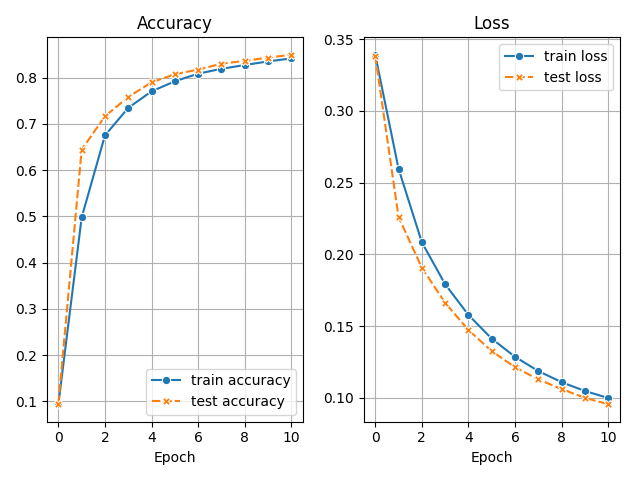

# TensorFlow Template

An artificial neural network is trained on the MNIST dataset to classify images of digits.
For each epoch, the train/test account/loss is written to the TensorBoard.
At the end of the training, these values are loaded from the TensorBoard and visualized by a plotting script.

I consider the code in this repository as a template for my upcoming projects in TensorFlow because the training and test steps, including the logging (writing train/test accuracy/loss to the TensorBoard) can be slightly adapted or reused. 
The same applies to the plotting script.
